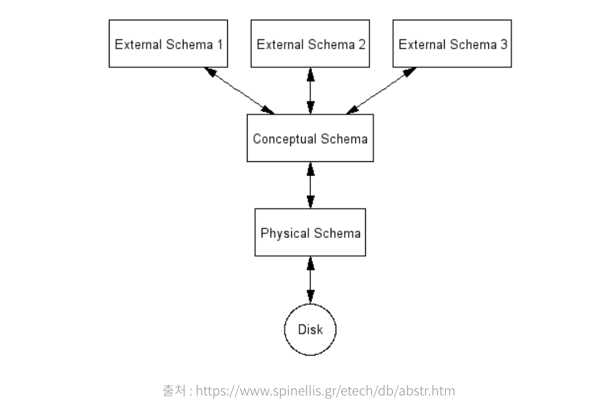
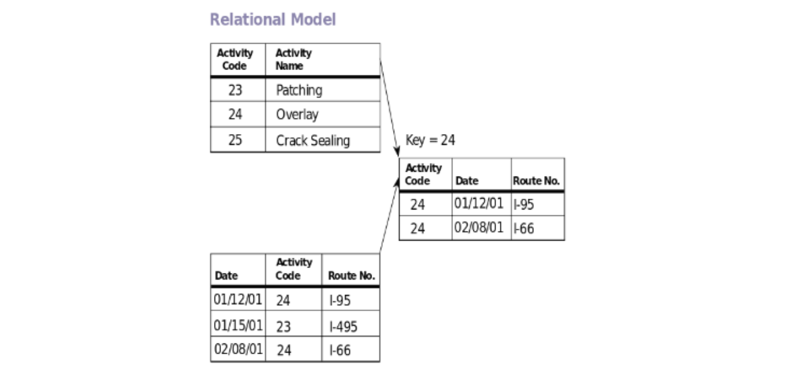

# 데이터 베이스 스키마

데이터 베이스 스키마는 DB에서 1. 데이터 구조 2. 데이터의 표현 방법 3. 데이터 간의 관계를 형식 언어로 정의한 구조이다. 널리 쓰이는 3단계 구조에서는 DB를 관점에 따라 외부 스키마, 개념 스키마, 내부 스키마로 나뉜다.

**외부 스키마는 각 사용자의 관점에 대해 보는 것이고, 개념 스키마에서는 모든 사용자의 관점으로 보는 것이며, 내부 스키마는 물리적으로 DB에 접근하는 관점으로 보는 것이다.**

이는 추상화와 비슷한데, 각 단계를 분리함으로써 논리적/물리적 독립성을 얻게 된다.

스키마란 데이터베이스의 기술이다. 데이터 시스템 언어 회의 데이터베이스를 기술하기 위해 사용하기 시작한 개념. 데이터베이스의 구조에 관해서 이용자가 보았을 때의 논리 구조와 컴퓨터가 보았을 때의 물리 구조에 대해 기술하고 있다. 데이터 전체의 구조를 정의하는 개념 스키마, 실제로 이용자가 취급하는 데이터 구조를 정의하는 외부 스키마 및 데이터 구조의 형식을 구체적으로 정의하는 내부 스키마가 있다.

# 관계형 데이터 모델

관계 모델에서는 이론적으로 DB를 관계의 집합으로, 관계를 행의 집합으로, 행을 속성의 집합으로 본다. RDB에서는 관계가 테이블, 행의 레코드, 속성이 컬럼으로 대치된다. 관계라는 이름으로 명명된 이유는 속성과 행이 어떤 관계에 의해 모여진 집합이기 때문이라는 추측이 있다. 관계에 있는 속성의 개수를 차수, 행의 개수를 Cardinality라고 한다. 예를 들어 유저 테이블에 id, password, email, created_date 4개의 컬럼과 2만 개의 레코드가 존재한다면 차수가 4, cardinality는 20000이 되는 것이다.

관계형 데이터 모델에서 속성은 해당 속성이 가질 수 있는 모든 값에 대한 도메인을 가지며, 원자적이어야 한다. 원자적이라는 뜻은 더 이상 쪼개어질 수 없다는 뜻이다. 예를 들어 숫자 속성은 더 이상 쪼개질 수 없는 원자적인 속성이지만 집합이나 리스트와 같은 데이터 모음에 대한 속성과 여러 속성을 합친 속성은 원자적이라고 볼 수 없다. 속성에는 null이라는 특별한 값이 허용된다. 그리고 관계 간에는 순서가 없고, 행 간에도 순서가 없다. 즉, 물리적으로 1000번째 레코드 다음에 1001번째 레코드가 존재하지 않을 수 도 있다는 뜻이다.

RDB에서는 관계의 집합과 제약 조건의 집합으로 이루어져 있다. 제약 조건으로는 1.키 제약조건, 2. 개체 무결성 제약조건, 3.참조 무결성 제약조건 등이 있다.

키는 슈퍼키, 후보 키(candinate key), 기본키(primary key)로 나뉜다. 슈퍼 키는 그 관계의 모든 행을 유일하게 식별할 수 있도록 하는 속성의 집합이다. 모든 속성을 모은 것을 슈퍼 키라고 할수도 있지만, 가능하면 적은 개수의 속성으로 키를 구성하는 것이 행을 식별하는 데 이점이 있다. 그렇기 때문에 후보 키라는 개념이 있으며, 후보 키는 슈퍼 키중 가장 속성의 개수가 적은 것이다. 예를 들어 슈퍼 키 A는 속성이 4개, 슈퍼키 B는 속성이 2개, 슈퍼키 C는 속성이 2개라면, B,C가 후보 키가 될 조건을 만족한다. 그 중에서도 하나의 후보키가 기본 키로 선택되고, 모든 관계는 단 하나의 기본 키 만을 가진다.

참조 무결성 제약 조건은 RDB에서 매우 중요한 제약 조건 중 하나이다. 흔히 외래 키로 알려진 키에 적용되는데, 외래 키의 대상 관계에 그 키를 가진 행이 반드시 존재해야 한다는 제약 조거니앋. 이 무결성 제약 조건으로 관계있는 데이터가 반드시 DB에 존재한다는 보장을 할 수 있으므로 매우 유용하다.
