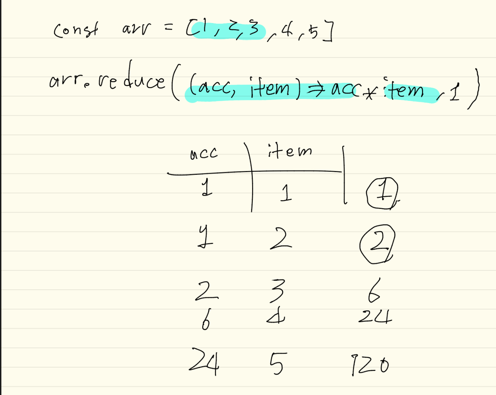

# 180416

## this

다른 함수들과 달리 '메소드'라는 특별한 이름을 사용하는 이유는, 메소드가 다른 함수들과는 다르게 특별히 취급되기 때문입니다. this 키워드를 사용하면, 메소드 호출 시에 해당 메소드를 갖고 있는 객체에 접근할 수 있습니다.

```js
const person = {
  name: '윤아준',
  age: 19,
  introduce() {
    // `this`를 사용해서 객체의 속성에 접근함
    return `안녕하세요, 제 이름은 ${this.name}입니다. 제 나이는 ${this.age}살 입니다.`
  },
  getOlder() {
    // `this`를 사용해서 객체의 속성을 갱신함
    this.age++;
  }
};

person.introduce(); // '안녕하세요, 제 이름은 윤아준입니다. 제 나이는 19살 입니다.'
person.getOlder(); // undefined
person.introduce(); // '안녕하세요, 제 이름은 윤아준입니다. 제 나이는 20살 입니다.'
```

메소드를 사용하면, 데이터와, 그 데이터와 관련된 동작을 객체라는 하나의 단위로 묶어서 다룰 수 있습니다. 이것이 함수 대신 메소드를 사용하는 핵심적인 이유입니다.

여기서 주의할 점이 있습니다. function 키워드를 통해 정의된 함수 내부의 this 키워드가 실제로 무엇을 가리킬 것인가는, 메소드가 어떻게 정의되는가에 의해 결정되는 것이 아니라 메소드가 어떻게 사용되는가에 의해 결정됩니다. 예를 들어 보겠습니다.

```js
function introduce() {
  return `안녕하세요, 제 이름은 ${this.name}입니다.`;
}

const person1 = {
  name: '윤아준',
  introduce
};

const person2 = {
  name: '신하경',
  introduce
};

person1.introduce(); // 안녕하세요, 제 이름은 운아준입니다.
person2.introduce(); // 안녕하세요, 제 이름은 신하경입니다.

```

> ### 새로 만든 배열, 객체는 전부 다 다른 취급을 한다

### 프로토 타입 : 수많은 객체에 공유되는 타입을 관리하기 위해 사용

우리가 쓰는 대부분의 프로그램들은 아주 많은 수의 비슷한 객체를 만들어냅니다.

* 스프레트시트의 셀
* 슈팅 게임에서의 총알
* DOM API의 HTMLElement

이 객체들은 아마도 각각 다른 속성을 가지고 있을 것입니다.

* 셀 안에 들어있는 데이터
* 총알의 현재 위치
* HTMLElement의 인라인 스타일

그렇지만, 그 수가 아무리 많더라도 공통으로 사용하는 속성과 메소드들이 있을 것입니다.

* 셀의 내용을 편집하는 메소드
* 총알의 모양
* 특정 HTMLElement에 키보드 포커스를 맞추는 메소드인 focus

위와 같이 수많은 객체가 공통으로 사용하는 속성과 메소드를 중복해서 저장하는 것은 컴퓨터의 아까운 저장 공간을 낭비하는 일일 것입니다. 예를 들어, 아래와 같이 객체를 생성하면 모든 객체에 똑같은 introduce 메소드가 저장되어 객체 1000개마다 별개의 함수, 즉 총 1000개의 함수가 생성됩니다.

```js
// 사람을 나타내는 객체를 생성하는 팩토리 함수
function personFactory(name) {
  return {
    name,
    introduce: function() {
      return `안녕하세요, 제 이름은 ${this.name}입니다.`;
    }
  };
}

const people = [];

for (let i = 0; i < 1000; i++) {
  people.push(personFactory('윤아준'))
}

people[0].introduce === people[1].introduce // false
```

```js
function introduce() {
      return `안녕하세요, 제 이름은 ${this.name}입니다.`;
    }

// 사람을 나타내는 객체를 생성하는 팩토리 함수
function personFactory(name) {
  return {
    name,
    introduce
  };
}

const people = [];

for (let i = 0; i < 1000; i++) {
  people.push(personFactory('윤아준'))
}
```

> ### 프로토 타입, 생성자, 클래스 순으로 배우면 JS의 객체지향 개념끝
> ### object...prototype은 거의 안쓴당

```js
const personPrototype = {
  introduce: function() {
    return `안녕하세요, 제 이름은 ${this.name}입니다.`;
  }
};

const person1 = Object.create(personPrototype); // 새 객체를 생성하고 프로토타입을 지정함
person1.name = '윤아준';

const person2 = Object.create(personPrototype);
person2.name = '신하경';

person1.introduce(); // 안녕하세요, 제 이름은 윤아준입니다.
person2.introduce(); // 안녕하세요, 제 이름은 신하경입니다.

person1.introduce === person2.introduce; // true
```

이렇게 프로토타입 기능을 이용해 한 객체에서 다른 객체의 기능을 가져와 사용하는 것을 프로토타입 상속(prototype inheritance)이라고 합니다. 위와 같은 경우는 "personPrototype은 person1의 프로토타입이다.", "person1 객체는 personPrototype 객체를 상속받았다"고 표현합니다. 프로토타입 상속은 다른 언어에서는 흔히 찾아볼 수 없는 JavaScript의 특징적인 기능입니다.4

```js
const parent = {
  familyName: '윤'
};
const child = Object.create(parent);

Object.getPrototypeOf(child) === parent; // true

const newParent = {
  familyName: '신'
};
Object.setPrototypeOf(child, newParent);
Object.getPrototypeOf(child) === parent; // false
```

### 프로토타입 체인 (Prototype Chain)

프로토타입 상속을 받은 객체가 실제로 어떻게 생겼는지를 확인해보겠습니다.

> ### 자바스크립트에서는 부모를 하나만 가진다. 대신 부모의 부모는 됨

```js
const grandparent = {
  c: 3
};
const parent = {
  a: 1
};
const child = {
  b: 2
};
Object.setPrototypeOf(child, parent);
Object.setPrototypeOf(parent, grandparent);
console.log(child); // { 'b': 2 }
console.log(child.c);
```

>Object.prototype에 여러 메소드들이 저장되있다.

```js
const obj1 = {
  a: 1
};
const obj2 = {
  b:2
}

Object.setPrototypeOf(obj2,obj1);

console.log(obj2.a);

obj2.hasOwnProperty('a');
```

### 속성 가리기 (Property Shadowing)

만약 프로토타입 체인에서 같은 이름의 속성이 여러 번 등장하면 어떤 일이 일어날까요? 아래 예제를 통해 확인해봅시다.
> 자식이 먼저 보게 되어 속성을 가린다

## 생성자 (Constructor)

이제까지는 객체를 생성하기 위해 객체 리터럴 또는 Object.create 함수를 사용했습니다. 하지만 이것 말고도 한 가지 방법이 더 있는데, 바로 new 키워드를 이용하는 것입니다.

```js
// 생성자 정의
function Person(name) {
  this.name = name;
}

// 생성자를 통한 객체 생성
const person1 = new Person('윤아준');
```

> 빈객체가 실행이됨

### 프로토타입을 간접적으로 변경하는 것은 불가능

```js
// 생성자 정의
function Person(name) {
  this.name = name;
}

// 생성자를 통한 객체 생성
const person1 = new Person('윤아준');
```

### 팩토리 함수의 재작성

수고하셨습니다! 이제 생성자를 사용할 준비를 마쳤습니다. 생성자를 이용해서 상단의 personFactory 함수를 다시 작성해보겠습니다.

```js
// 사람을 나타내는 객체를 생성하는 팩토리 함수
function Person(name) {
  this.name = name;
}
Person.prototype.introduce = function() {
  return `안녕하세요, 제 이름은 ${this.name}입니다.`;
};

const person = new Person('윤아준');

person.introduce(); // '안녕하세요, 제 이름은 윤아준입니다.'
```

> 객체의 프로토 타입 vs 생성자의 프로토타입

* 개별적으로 저장되아야 하는것은 생성자를 통해 저장
* 공유되어야 하는 동작은 프로토 타입 객체 속성에 저장
* 생성자와 프로토타입간의 관계

### 정적 메소드 (Static Method)

JavaScript의 함수는 객체이기도 하다는 사실을 앞에서 언급했습니다. 생성자의 속성에 직접 지정된 메소드를 가지고 정적 메소드(static method)라고 합니다. 우리가 이제까지 유용하게 사용했던 Number.isNaN, Object.getPropertyOf 등의 함수들은 모두 정적 메소드입니다. 정적 메소드는 특정 인스턴스에 대한 작업이 아니라, 해당 생성자와 관련된 일반적인 작업을 정의하고 싶을 때 사용됩니다.

## 배열

## reduce

reduce 메소드는 `모든 요소의 값을 종합해서 하나의 값으로 만드는 계산`을 할 때 사용합니다.

```js
const arr = [1, 2, 3];

arr.reduce((acc, item) => acc + item, 0); // 6
```

위 코드에서 일어난 일을 순서대로 써보면 다음과 같습니다.

초기값 0과 배열의 첫 번째 요소인 1을 인수로 해서 함수를 호출합니다. 즉, acc 매개변수에 0이 대입되고, item 매개변수에 1이 대입됩니다. 결과값은 1이 됩니다. 이 값을 누적값(accumulator)라고 부릅니다.
누적값 1과 배열의 두 번째 요소인 2를 인수로 해서 함수를 호출합니다. 결과값 3이 다시 누적값이 됩니다.
누적값 3과 배열의 세 번째 요소인 3을 인수로 해서 함수를 호출합니다. 결과값은 6입니다.
더 이상 요소가 남아있지 않으므로 reduce 호출의 결과값은 6이 됩니다.
처음에는 어렵지만, 익숙해지면 reduce는 배열에 대한 계산을 하는 만능 도구로 사용할 수 있습니다. 실제로, 배열의 많은 메소드들이 reduce를 통해 다시 구현될 수 있습니다. 이는 연습문제로 남깁니다.



reduce에 주어지는 함수 역시 forEach나 map과 마찬가지로 여러 개의 인수를 받는데, 맨 앞에 누적값이 추가되어 (누적값, 현재 요소, 인덱스, 배열)와 같은 인수를 받습니다.

```js
const arr = ['one', 'two', 'three'];

arr.reduce((acc, item, index, array) => {
  return acc + `(${index}: ${item})`;
}, ''); // '(0: one)(1: two)(2: three)'
```

reduce 메소드에 초기값 인수를 주지 않으면, 첫 번째 인수가 초기값으로 지정되어 첫 번째 요소와 두 번째 요소에 대한 계산부터 시작합니다. 즉, 위 두 예제에서 초기값을 생략해도 같은 결과가 나옵니다. 다만, 배열의 요소가 하나 밖에 없다면 아래와 같이 계산이 수행되지 않고 첫 번째 요소가 그대로 반환되므로, 초기값은 항상 제공해주는 것이 좋습니다.

```js
const arr = ['one'];

// 문자열의 길이를 모두 더하려고 했지만...
// 계산을 수행할 대상이 하나밖에 없어서 함수가 호출되지 못하고 결과값으로 'one'이 반환됩니다.
arr.reduce((acc, item) => {
  return acc + item.length;
}); // 'one'

// 초기값을 주면 계산이 제대로 수행됩니다.
arr.reduce((acc, item) => {
  return acc + item.length;
}, 0); // 3
```

### 배열이 특정 조건을 만족하는지 판별하기

배열의 세 메소드 `includes, every, some`는 모두 배열이 특정 조건을 만족하는지를 나타내는 진리값을 반환합니다.

ES2016에서 도입된 includes 메소드는 배열이 특정 요소를 포함하고 있는지를 판별합니다. indexOf로도 비슷한 일을 할 수 있지만 includes가 진리값을 반환한다는 점에서 조금 더 편합니다. includes 메소드 역시 시작 인덱스를 인수로 받습니다.

```js
const arr = ['one', 'two', 'three'];

arr.includes('one'); // true
arr.includes('one', 1); // false
```

every는 predicate을 인수로 받아서, 모든 요소가 조건을 만족하는 지를 검사합니다.

```js

const arr = ['one', 'two', 'three'];

arr.every(item => item.length > 2); // true
arr.every(item => item.length > 3); // false
```

some은 predicate을 인수로 받아서, 조건을 만족하는 요소가 하나라도 있는지 검사합니다.

```js
const arr = ['one', 'two', 'three'];

arr.some(item => item.length > 3); // true
arr.some(item => item.length > 5); // false
```

## 2. TIL

this, prototype,reduce, some every includes에 대해 배웠다.
this 는 간단하다 메소드 호출시에 해당 메소드의 객체에 접근이 용이하도록 사용하는 것이다. 메소드의 사용에 의해 결정된다.
그중에 prototype은 조금 넘사 였던 것 같다. 지금 조금 더 정리해보자
 Prototype Link 와 Prototype Object 이둘을 정확히 이해하고 가지고 놀수 있어야 할 정도가 되어야 한다고 한다. 모든 객체(Object)의 조상은 함수(Function)이다.

`function Person() {} // => 함수`

```var personObject = new Person(); // => 함수로 객체를 생성```

프로토타입은 재사용이 가능하다 공용으로 사용가능한 부분은 프로토 타입이다. 가장 지정하기 쉬운방식은 Object.create방식이다.

## 3 repo

[hasOwnPrototype](https://developer.mozilla.org/ko/docs/Web/JavaScript/Reference/Global_Objects/Object/hasOwnProperty)

[prototype method](https://developer.mozilla.org/ko/docs/Web/JavaScript/Reference/Global_Objects/String/prototype#Methods)

[protoType](https://medium.com/@bluesh55/javascript-prototype-%EC%9D%B4%ED%95%B4%ED%95%98%EA%B8%B0-f8e67c286b67)

[연습가능한js](http://exercism.io/languages/javascript/exercises)